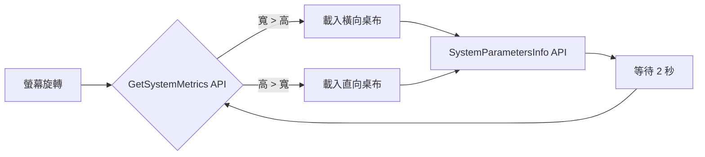

> [!info] 適用機型
> Fujitsu Q7311 / Q738 及各類 Windows 10/11 平板電腦

Author: [George Kang](https://t.me/yuskang) | [mail me](mailto:yuskang@gmail.com)

---

## 前言

Windows 原生功能並不支援「依據螢幕直向/橫向自動切換不同桌布」。在平板豎持時，原本的橫向桌布通常會被裁切或留白，影響美觀。

本教程透過一個 **PowerShell 腳本 + 捷徑隱藏執行**，達成以下效果：

| 功能 | 說明 |
|------|------|
| 🔄 即時偵測 | 使用 Windows API 即時取得螢幕方向 |
| 🖼️ 自動換圖 | 橫向用橫圖，直向用直圖 |
| ✨ 完美適配 | 強制使用「符合 (Fit)」模式，保留圖片完整比例 |
| 👻 背景執行 | 透過捷徑參數隱藏視窗，完全無感執行 |
| 🔋 省電設計 | 每 2 秒偵測一次，CPU 影響極低 |

> [!note] 版本資訊
> 本文為 **V5.4 穩定版**，使用 `GetSystemMetrics` API 即時偵測螢幕尺寸，解決了舊版螢幕資訊快取導致無法即時切換的問題。

---

## 步驟一：準備桌布圖片

> [!tip] 格式建議
> 建議使用 **.png**（無損）或 **.jpg** 格式

1. 準備兩張圖片（橫向/直向）
2. 建立簡單路徑存放，例如 `C:\Wallpapers`

```
C:\Wallpapers\
├── Landscape.png  ← 橫向用
└── Portrait.png   ← 直向用
```

---

## 步驟二：設定 Windows 底色（黑邊準備）

為了讓圖片在「符合 (Fit)」模式下，上下留白處呈現完美的黑色（而非預設藍色）：

1. 桌面按右鍵 → **個人化 (Personalize)**
2. 點選 **背景 (Background)**
3. 將背景選單暫時切換為 **純色 (Solid color)**
4. 選擇 **黑色**
5. 設定完成後關閉視窗

---

## 步驟三：建立自動切換腳本

### 建立步驟

1. 開啟**記事本**
2. 複製以下完整程式碼
3. 儲存為 `C:\Wallpapers\WallpaperRotator.ps1`
   - 儲存類型選「**所有檔案**」
   - 編碼選「**UTF-8**」

> [!caution] 重要
> 請確保檔案副檔名是 `.ps1` 而非 `.ps1.txt`

### 完整程式碼（V5.4）

```powershell
# ==========================================
# WallpaperRotator V5.4 即時偵測版
# 使用 Windows API 取得即時螢幕尺寸
# ==========================================

$LandscapePath = "C:\Wallpapers\Landscape.png"
$PortraitPath  = "C:\Wallpapers\Portrait.png"

Add-Type @"
using System;
using System.Runtime.InteropServices;
public class WinAPI {
    [DllImport("user32.dll", CharSet = CharSet.Auto)]
    public static extern int SystemParametersInfo(int uAction, int uParam, string lpvParam, int fuWinIni);
    
    [DllImport("user32.dll")]
    public static extern int GetSystemMetrics(int nIndex);
}
"@

$SPI_SETDESKWALLPAPER = 0x0014
$UpdateIniFile = 0x01
$SendWinIniChange = 0x02
$SM_CXSCREEN = 0
$SM_CYSCREEN = 1
$CurrentState = "Unknown"

function Set-WallpaperStyle {
    Set-ItemProperty -Path "HKCU:\Control Panel\Desktop" -Name WallpaperStyle -Value "6" -ErrorAction SilentlyContinue
    Set-ItemProperty -Path "HKCU:\Control Panel\Desktop" -Name TileWallpaper -Value "0" -ErrorAction SilentlyContinue
}

while ($true) {
    try {
        $Width = [WinAPI]::GetSystemMetrics($SM_CXSCREEN)
        $Height = [WinAPI]::GetSystemMetrics($SM_CYSCREEN)

        if ($Width -gt $Height) {
            $TargetFile = $LandscapePath
            $TargetState = "Landscape"
        } else {
            $TargetFile = $PortraitPath
            $TargetState = "Portrait"
        }

        if ($CurrentState -ne $TargetState) {
            if (Test-Path $TargetFile) {
                Set-WallpaperStyle
                [WinAPI]::SystemParametersInfo($SPI_SETDESKWALLPAPER, 0, $TargetFile, $UpdateIniFile -bor $SendWinIniChange)
                $CurrentState = $TargetState
            }
        }
    }
    catch {
    }

    Start-Sleep -Seconds 2
}
```

---

## 步驟四：設定開機自動執行

### 建立捷徑

1. 桌面空白處按右鍵 → **新增** → **捷徑**
2. 在「輸入項目的位置」欄位中，貼上以下指令：

```
powershell.exe -ExecutionPolicy Bypass -WindowStyle Hidden -File "C:\Wallpapers\WallpaperRotator.ps1"
```

1. 按 **下一步**，名稱輸入 `WallpaperRotator`，按 **完成**

### 放入啟動資料夾

1. 按 `Win + R`，輸入 `shell:startup` 並按 Enter
2. 將捷徑**剪下**並**貼入**「啟動」資料夾中

> [!success] 完成！
> 雙擊捷徑測試，程式會在背景執行（不會有任何視窗彈出）。
> 旋轉平板，桌布應會在 2 秒內隨之切換。

---

## 捷徑設定檢查表

| 項目 | 設定值 |
|------|--------|
| **目標 (Target)** | `powershell.exe -ExecutionPolicy Bypass -WindowStyle Hidden -File "C:\Wallpapers\WallpaperRotator.ps1"` |
| **起始位置 (Start in)** | `C:\Wallpapers`（或留空） |

---

## 常見問題排查

> [!faq]- 執行時出現「無法載入檔案」錯誤？
> 請確保使用完整指令執行，包含 `-ExecutionPolicy Bypass`：
>
> ```
> powershell.exe -ExecutionPolicy Bypass -File "C:\Wallpapers\WallpaperRotator.ps1"
> ```

> [!faq]- 執行後螢幕變成全黑？
>
> - 檢查 `.ps1` 檔內的 `$LandscapePath` 與 `$PortraitPath` 路徑是否正確
> - 確認圖片檔案本身沒有損壞（試著用小畫家開啟看看）

> [!faq]- 旋轉後桌布沒有切換？
>
> - 確認使用的是 V5.4 版本（使用 `GetSystemMetrics` API）
> - 舊版使用 `System.Windows.Forms.Screen` 會有螢幕資訊快取問題

> [!faq]- 如何關閉這個程式？
> 開啟「工作管理員 (Task Manager)」，在「處理程序」或「詳細資料」分頁中找到 `Windows PowerShell`，按右鍵選擇「結束工作」。

> [!faq]- 旋轉後反應有點慢？
> 腳本設定每 2 秒檢查一次。若希望反應更快，可將腳本末端的 `Start-Sleep -Seconds 2` 改為 `1`。

---

## 技術原理



---

*Last updated: 2026-01-15*
